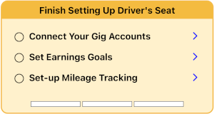

# Campaigns

Campaigns support dynamic content that is presented in the mobile app without having to do a mobile app release.

## Types of Campaigns

* **Call to Action**  
  Presents an externally hosted (framed) view to the user with a set of actions that may be performed.
   

* **Surveys**  
  Presents a series of pages (sections) where information can be presented and/or collected from the user.
   

* **Checklist**  
  Presents a list of tasks/actions along with their status.
   
  

## All Campaigns have

* **ID**  
   

* **Qualification Criteria**  
  * Include or Exclude Mobile App Versions
  * Custom Function
     

* **Status**   
  * Not Started
  * Presented
  * Postponed (until)
  * Dismissed
  * Accepted
   

* **Saved State** (survey only)  

## Campaign Preview Cards

* Customizing the Landing Page

## Static Content

## Database Queries

## Mixpanel Integration

## How to Create a Campaign

## Examples