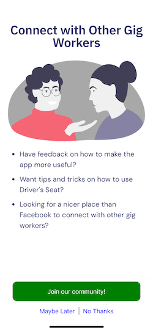
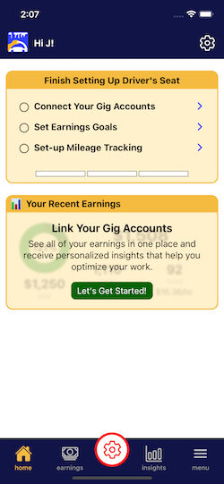
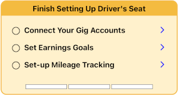

# Campaigns

Campaigns support the presentation and interaction of dynamic content in the mobile app.  Defined in the API layer (in code), campaigns may be tailored for the calling user and/or device being used; released and/or modified without the need for a mobile app release.

* [Define a Campaign](#defining-a-campaign)
* [Determine the Audience using Qualifying Criteria](#qualifying-criteria-for-a-campaign)
* [Determine how the campaign is surfaced using Campaign Categories](#adding-categories-to-a-campaign)
* [Add a Campaign Card (Surveys and CTAs only)](#creating-a-campaign-card)
* [Enable the Campaign](#enable-the-campaign)
* [Track Campaign Results](#track-campaign-results)

## Defining a Campaign

There are 3 campaign types.

* [Call To Action (CTA)](#calls-to-action-ctas)
* [Survey](#surveys)
* [Checklist](#checklists)

### [Calls to Action (CTAs)](./call_to_action/README.md)

A call to action presents information to the user a a single view of hosted web content.  Users may be presented various actions.

|  |
|---                                          |

### [Surveys](./surveys/README.md)

A survey is an interactive workflow divided into one or many pages (known as sections).  Each section presents and can/usually collects information from the user.  Information collected from the user is stored in the `additiona_info` column of table `campaign_participants`.

  |  |  ||
  |-- |-- |--|
  
### [Checklists](./checklists/README.md)

A checklist is a list of tasks/items with status information.  Unlike surveys and CTAs, checklists appear as cards that are embedded within other application pages.

  |  |  |
  |-- |-- |
  
## Qualifying Criteria for a Campaign

Qualifying criteria allows the filtering of campaigns for specific users, devices, and or conditions.

* If a campaign has been [dismissed](./campaign_actions/README.md#dismiss), it is always excluded.
* If there is no other qualification critera, the campaign qualifies for all users.

### Qualify for specific App Version(s)

Filter campaigns based on the version of the mobile app making the call.

Example: This CTA will only be available to callers on a version < 4.0.0.

```elixir
CallToAction.new(:upgrade_for_better_mileage_tracking)
|> Campaign.include_app_version("< 4.0.0")
```

```elixir
CallToAction.new(:upgrade_for_better_mileage_tracking)
|> Campaign.exclude_app_version(">= 4.0.0")
```

### Qualify based on Custom Criteria using a function

Provide a function that accepts a [CampaignState](../../lib/dsc/marketing/campaign_state.ex) struct and returns TRUE if the caller should have access to the campaign.

This survey will become available 5-days after the user has created their account if they have not successfully set up a gig-account.

```elixir
defmodule DriversSeatCoop.Marketing.Campaigns.Examples do
  alias DriversSeatCoop.GigAccounts
  alias DriversSeatCoop.Marketing.Campaign
  alias DriversSeatCoop.Marketing.Survey
  alias DriversSeatCoop.Repo

  @five_days_seconds 60 * 60 * 24 * 5

  def survey do
    Survey.new(:connect_gig_accts)
      |> Campaign.is_qualified(fn %CampaignState{} = state ->
        # it has been less that 5 days
        if NaiveDateTime.diff(NaiveDateTime.utc_now(), state.user.inserted_at) < @five_days_seconds do
          false
        else
          # user has not already connected a gig account
          not (GigAccounts.query()
               |> GigAccounts.query_filter_user(state.user.id)
               |> GigAccounts.query_filter_is_connected()
               |> Repo.exists?())
        end
      end)
  end
end
```

## Adding Categories to a Campaign

Campaigns can be assigned one or many categories which determines where they will be surfaced in the application.

```elixir
CallToAction.new(:upgrade_for_better_mileage_tracking)
|> Campaign.with_category([
  :interrupt, 
  :info
])
```

### Adding Categories Dynamically

Categorization can also be dynamic.  Provide a function that accepts a [CampaignState](../../lib/dsc/marketing/campaign_state.ex) struct and returns one or many categories.

This campaign is initially presented in full-screen mode (because of the `:interrupt` category). If the user accepts the campaign, it will also add a preview card to their dashboard (because of the `:dashboard_info` category).

```elixir
CallToAction.new(:connect_with_other_drivers_whatsapp)
|> Campaign.with_category(fn %CampaignState{} = state ->

  result = [:interupt]

  if is_nil(state.participant.accepted_on),
    do: result ++ [:dashboard_info],
    else: result
end)
```

### The `:interrupt` Category for CTAs and Surveys

CTAs and Surveys that are categorized as `:interrupt` will interrupt the user's workflow when ALL of the following conditions are met.

* User meets the [qualification criteria](#qualifying-criteria-for-a-campaign).
* User has not [accepted](./campaign_actions/README.md#accept) or [dismissed](./campaign_actions/README.md#dismiss) the campaign.
* Campaign is not currently [postponed](./campaign_actions/README.md#postpone-for-duration) for the user.

If multiple campaigns meet these criteria, they will be presented one at a time, in the order in which they have been [enabled](#enable-the-campaign).

## [Creating a Campaign Card](./campaign_cards/README.md)

CTAs and Surveys can have a preview card that is displayed on the dashboard and/or custom page.

```elixir
@campaign_id :connect_with_other_drivers_whatsapp

CallToAction.new(@campaign_id)
|> Campaign.with_category(:dashboard_info)
|> Campaign.with_preview(
  CampaignPreview.new()
  |> CampaignPreview.with_title("Connect with Other Gig Workers")
  |> CampaignPreview.with_left_image_url("#{@campaign_id}/preview.png")
  |> CampaignPreview.with_action([
    CampaignAction.default_dismiss_tool(),
    CampaignAction.default_help_tool("I need help joining the Driver's Seat Community"),
    CampaignAction.new(:accept_preview, :accept, "Join our Community!")
    |> CampaignAction.with_url(@whatsapp_invite_url)
  ])
)
```

Find out nore about how to implement a [campaign preview card](../campaigns/campaign_cards/README.md).

## Enable the Campaign

Add the campaign to the active campaigns in [marketing.ex](../../../lib/dsc/marketing.ex).  [Interrupt](#the-interrupt-category) campaigns should be added in the order it which they are to be presented.

```elixir
defmodule DriversSeatCoop.Marketing do
  alias DriversSeatCoop.Marketing.Campaigns.Examples
  alias DriversSeatCoop.Marketing.Campaigns.GoalsSurvey
  alias DriversSeatCoop.Marketing.Campaigns.MileageTrackingIntroSurvey

  def get_active_campaigns do
    [
      Examples.cta(),                             # this is the new CTA
      GoalsSurvey.instance(),
      MileageTrackingIntroSurvey.instance()
    ]
  end
```

## Track Campaign Results

There are two ways to track campaign results

* Database table `CampaignParticipant` contains information about when a campaign was first/last viewed (full screen), when and how (action) it was accepted, when and how (action) it was dismissed, and/or when and how (action) it was last posponed.
* Mixpanel receives events in the form of `campaign/${campaign_id}/${event_type}`.  For example `campaign/connect_with_other_drivers_whatsapp/accept`
  * Within the event data is the `action` which represents the [Campaign Action](./campaign_actions/README.md) that caused the event to be tracked.
  * For Surveys, the form data is captued in event properties based using `field_id`.