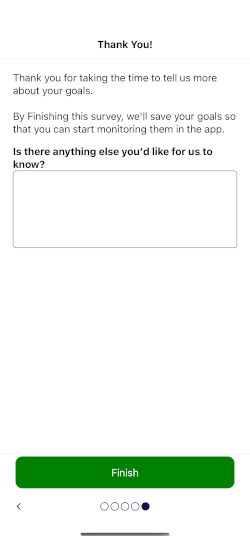

# Campaigns

Campaigns support the presentation and interaction of dynamic content in the mobile app.  Because they are defined in the API layer (in code), campaigns:

* May be tailored for the calling user and/or device being used.
* May be released and/or modified without the need for a mobile app release.
* Take affect immediately

## Types of Campaigns

### Calls to Action (CTAs)

A call to action presents information to the user a a single view of hosted web content.  Users may be presented various actions.

|  |
|---                                          |

### Surveys

A survey is an interactive workflow divided into one or many pages (sections).  Each section presents and (usually) collects information from the user.  Information collected from the user is stored in the database.

  |  |  |
  |-- |-- |--
  
### Checklists

A checklist is a list of tasks/items with status information.  Unlike surveys and CTAs, checklists appear as cards that are embedded within other application pages.

  |  |  |
  |-- |--
  

---------------------------

  

## All Campaigns have

* **ID**  
   

* **Qualification Criteria**  
  * Include or Exclude Mobile App Versions
  * Custom Function
     

* **Status**   
  * Not Started
  * Presented
  * Postponed (until)
  * Dismissed
  * Accepted
   

* **Saved State** (survey only)  

## Campaign Preview Cards

* Customizing the Landing Page

## Static Content

## Database Queries

## Mixpanel Integration

## How to Create a Campaign

## Examples