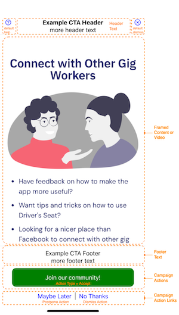

# Calls to Action (CTAs)




## Declaring the Campaign

```elixir
alias DriversSeatCoop.Marketing.CallToAction
alias DriversSeatCoop.Marketing.Campaign
alias DriversSeatCoop.Marketing.CampaignAction

cta = CallToAction.new(:example_cta)
```

## Identifying hosted content

### Externally Hosted Content

```elixir
cta = CallToAction.with_content_url(cta, "https://blog.driversseat.co/campaigns/whatsapp-community/intro-whatsapp-community")
```

### Self-hosted Content

When the content_url is relative, it is assumed to be self-hosted on the web/api server and deployed with the code releases.

```elixir
cta = CallToAction.with_content_url(cta, "example_cta/example.html")
```

In the example above, the files should be placed in the structure below.

```text
.
└── priv
    └── static
        └── campaigns
            └── example_cta
               ├── example.html
               ├── example.css
               └── example_image.png
```

### Video (Youtube)

Youtube video is also supported

```elixir
cta = CallToAction.with_content_url(cta, "https://www.youtube.com/watch?v=hsdUR2QXj1s")
```

## Adding Header Text

```elixir
cta =
  CallToAction.with_header(cta, [
    "Example CTA Header",
    "more header text"
  ])
```

## Adding Footer Text

```elixir
cta =
  CallToAction.with_footer(cta, [
    "Example CTA Footer",
    "more footer text"
  ])
```

## Adding Actions

### Default Help
### Default Dismiss
### Campaign Actions (as buttons)
### Campaign Actions (as links)

```elixir
cta =
  CallToAction.with_action(cta,
    CampaignAction.new(:join, :accept, "Join our community!")
    |> CampaignAction.
  )
```

## Associate to Categories


```elixir
cta = Campaign.with_category(cta, :interrupt)  
```
