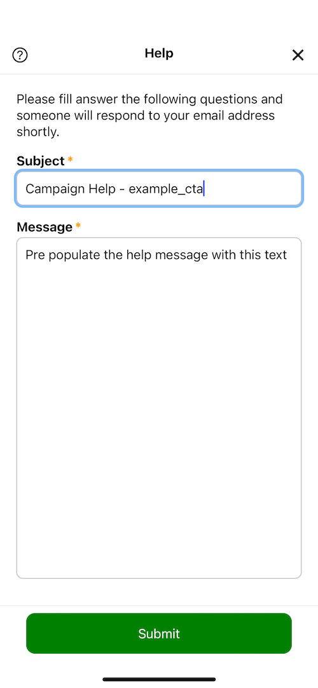

# Calls to Action (CTAs)

A call to action presents information to the user a a single view of hosted web content.  Users may respond to the CTA using various actions.  They should be considered one-way communication.


## Declaring the campaign  (Required)

```elixir
defmodule DriversSeatCoop.Marketing.Campaigns.Examples do
  
  alias DriversSeatCoop.Marketing.CallToAction

  # using a module attribute will be helpful as you declare content
  @example_cta :example_cta

  def cta do
    CallToAction.new(@example_cta)
  end
end
```

## Identifying the hosted content (Required)

### Self-hosted Content

When the url is relative, it is assumed that the content is hosted on the same server as the API, managed in source control, and deployed with each release.

```elixir
defmodule DriversSeatCoop.Marketing.Campaigns.Examples do
  
  alias DriversSeatCoop.Marketing.CallToAction

  @example_cta :example_cta

  def cta do
    CallToAction.new(@example_cta)
    |> CallToAction.with_content_url("#{@example_cta}/example.html")
  end
end
```

Hosted assets (like html, css, images, fonts, js) are placed within the `/priv/static/campaigns` folder and managed as part of source control.

* **Asset and folder names are case sensitive** and need to match the filename of the asset.  `example_cta/example.html` is NOT the same as `example_cta/Example.html` OR `example_CTA/example.html`
<br/>

* **Consider having a common campaign.css file** and add relative references to it from within the html files for each campaign.  That will make style changes a bit easier.
<br/>

* **Consider having a folder structure convention** such as `/priv/static/campaigns/<<CAMPAIGN_ID>>/` for the assets for each campaign.  The CTA defined above would follow this folder structure.

  ```text
  .
  └── priv
      └── static
          └── campaigns
              ├── campaigns.css
              └── example_cta
                  ├── example.html
                  ├── example.css
                  ├── example_image1.png
                  └── example_image2.png
  ```

* **Browsing to campaign assets directly** Self-hosted assets are browseable.  During development for the example above, `http://localhost:4000/web/campaigns/example_cta/example.html` should present the content of the CTA.
<br/>

* **The [endpoint.ex](/lib/dsc_web/endpoint.ex) file** is respoinsible for mapping inbound url requests to static files.

### Externally Hosted Content

CTA content may also be hosted elsewhere, which may be helpful when the content is managed outside of the app, or if the assets are large and  difficult to manage in source control.  

To access externally hosted content, use fully qualified URLs for the resources.

```elixir
defmodule DriversSeatCoop.Marketing.Campaigns.Examples do
  
  alias DriversSeatCoop.Marketing.CallToAction

  @example_cta :example_cta

  def cta do
    CallToAction.new(@example_cta)
    |> CallToAction.with_content_url("https://blog.driversseat.co/campaigns/whatsapp-community/intro-whatsapp-community")
  end
end
```

#### YouTube Video Content

CTA content may be a Youtube hosted video.  The URL must be in the form below using the embed syntax.

```elixir
defmodule DriversSeatCoop.Marketing.Campaigns.Examples do
  
  alias DriversSeatCoop.Marketing.CallToAction

  @example_cta :example_cta

  def cta do
    CallToAction.new(@example_cta)
    |> CallToAction.with_content_url("https://www.youtube.com/embed/1zGlYNS2qGk")
  end
end
```

## Adding Header and Footer Text (Optional)

|   |     |
|--                               |--                                 |

### Single Line

```elixir
cta
|> DriversSeatCoop.Marketing.CallToAction.with_header("Single Line Header")
|> DriversSeatCoop.Marketing.CallToAction.with_footer("Single Line Footer")
```

### Multi-Line

```elixir
cta
|> DriversSeatCoop.Marketing.CallToAction.with_header([
    "Main Title (displayed in bold)",
    "Sub Title 1 (smaller and not bold)"
])
|> DriversSeatCoop.Marketing.CallToAction.with_footer([
    "Main footer",
    "Footer Line 2"
])
```

### Dynamic Content

A function accepting a [CampaignState](/lib/dsc/marketing/campaign_state.ex) struct may also be used.  CampaignState provides access to information about the calling user, their device, and the calling user's interaction with this campaign.

```elixir
alias DriversSeatCoop.Marketing.CallToAction
alias DriversSeatCoop.Marketing.CampaignState

cta
|> CallToAction.with_header(fn %CampaignState{} = state ->
  "Hi, #{state.user.first_name}"
end)
|> CallToAction.with_header(fn %CampaignState{} = state ->
  "You're using an #{state.device.device_platform} device"
end)
```

## Adding Actions

Campaign Actions define how a user can interact with the campaign.

### Header Actions

#### Help button

|      |     |
|----                                           |---                            |

```elixir
CallToAction.with_action(cta,
  CampaignAction.default_help_tool("Pre populate the help message with this text")
)
```

#### Close button

|    |
|----                                                     |

A CTA may be closed in the following ways

##### Close

Closing a CTA closes the screen in the UI, keeping the campaign available for access in the future.  This method is used when the user takes an action that opens the CTA. For example, a user may navigate to a CTA from a preview card on their landing page.

```elixir
CallToAction.with_action(cta, CampaignAction.default_close_tool())
```

##### Dismiss

Dismissing a CTA closes the screen in the UI and is the equivalent to deleting it for the user, preventing any future access.  This method is often used in conjunction with the user's workflow being interrupted by the CTA.

```elixir
CallToAction.with_action(cta, CampaignAction.default_dismiss_tool())
```

##### Postpone

Postponing a CTA closes the screen in the UI and prevents the CTA from interrupting the user's workflow for a period of time, by default 24 hours.  This method allows the user to focus their attention on something else when a CTA interrupts their workflow.

```elixir
CallToAction.with_action(cta, CampaignAction.default_postpone_tool())
```

### Action Buttons

|   |
|----                                             |

```elixir
cta
|> CallToAction.with_action(
  CampaignAction.new(:join, :accept, "Join our community!")
  |> CampaignAction.with_url("https://chat.whatsapp.com/XXXXXXXXXXXXXXXXXXXXXX")
)
```

* This "Accepts" the campaign with accept_action `join`
* Accept Actions close the CTA view
* A URL is NOT required.  Because there is a FULLY-QUALIFIED URL, an in-app browser will open and navigate to the content.

```elixir
cta
|> CallToAction.with_action(
  CampaignAction.new(:invite, :accept, "Invite a friend!")
  |> CampaignAction.with_url("/marketing/referral/generate/app_invite_menu")
)
```

* This "Accepts" the campaign with accept_action `invite`
* Accept Actions close the CTA view
* A URL is NOT required.  Because there is a RELATIVE URL, it will navigate within the Angular app using its router.

### Action Links

|   |
|----                                         |

```elixir
CallToAction.with_action(cta,
  CampaignAction.new(:join, :accept, "Join our community!")
  |> CampaignAction.
)
```

## Associate to Categories


```elixir
cta = Campaign.with_category(cta, :interrupt)  
```
