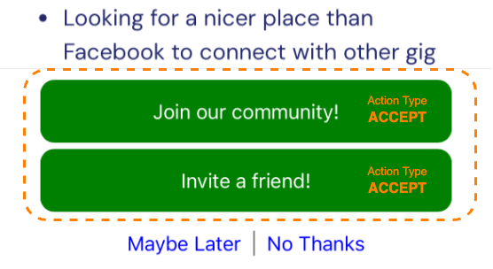
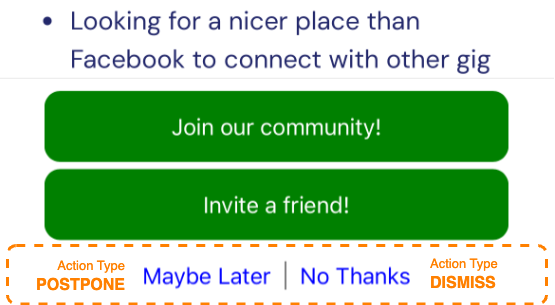
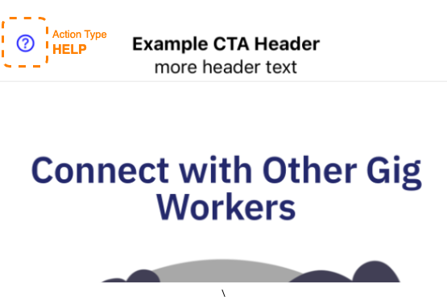
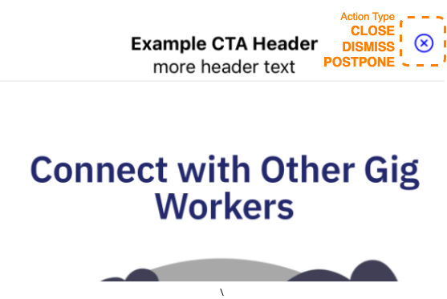

# Campaign Actions

Campaign Actions define how a user may interact with a campaign and what happens next.

* [Types of Actions](#action-types)
* [Layout of Actions](#layout)
* [Redirecting users to a URL after an action](#adding-a-url-to-an-action)
* [Add custom code to actions using Action Hooks](#action-hooks)
* [Surfacing actions on campaigns](#adding-actions-to-campaigns)

## Action Types

### Accept

Campaigns, especially those that interrupt a user's workflow, often present the user with a choice or an invitation.  Accepting a campaign indicates a user's assent.

* By default, accepting a campaign closes the full-screen campaign view.
* Accepting a campaign prevents it from interrupting a user's workflow again.
* An accepted campaign remains available to the user for future reference.
* Updates database table `campaign_participants`, columns `accepted_action` and  `accepted_on` (UTC).

```elixir
CampaignAction.new(:connect_accounts, :accept, "Connect your Gig Accounts Now")
```

### Dismiss

Dismissing a campaign essentially deletes it for the user.  When campaigns present a choice or an invitation to the user, dismissing it indicates their dissent.

* By default, dismissing a campaign closes the full-screen campaign view.
* Dismissing a campaign prevents it from interrupting a user's workflow.
* Dismissed Campaigns are no longer available to the user for future reference.
* Updates database table `campaign_participants`, columns `dismissed_action` and  `dismissed_on` (UTC).

```elixir
CampaignAction.new(:no_thanks, :dismiss, "No Thanks!")
```

### Postpone (for duration)

Campaigns can interrupt the users's workflow.  Postponing the campaign allows the user to focus their attention on something else.  After a certain amount of time, the campaign will resurface in the UI interrupting their workflow.

* Postponing a campaign closes the full-screen campaign view.
* Campaign remains available for future reference.
* Campaign WILL interrupt the user's workflow after a specified period of time.
* Updates database table `campaign_participants`, columns `postponed_action` and  `postponed_until` (UTC).

```elixir
CampaignAction.new(:maybe_later, :postpone, "Maybe Later")
|> CampaignAction.with_postpone_minutes(90)
```

### Close

For campaigns that DO NOT interrupt the user's workflow, closing the campaign returns the user to what they were working on before.

* By default, closing a campaign closes the full-screen campaign view.
* Campaign remains available to the user for reference.
* Generally, close is not used for campaigns that interrupt the user's workflow.
* Does NOT update database table `campaign_participants`.

```elixir
CampaignAction.new(:request_close, :close, "Close Me")
```

### Help (with default message text)

A campaign may allow the user to submit a customized help request with a prepopulated message.

/// SHOW HELP INTERACTION HERE ///

* Opens a new help request dialog window
* Requesting help DOES NOT close the underlying campaign view
* Does NOT update database table `campaign_participants`.

```elixir
CampaignAction.new(:help_me, :help, "I have a question")
|> CampaignAction.with_data(%{
  message_text: "[ Tell us how we can help you with this campaign ]"
})
```

### Open Detail View

CTAs and Surveys can be surfaced as a preview card on the landing page.  The Detail action will open up the CTA or Survey in full-screen view.

* Opens the full-screen version of the campaign.
* Does NOT update database table `campaign_participants`.

///SHOW CAMPAIGN CARD HERE///

### Logout

Provides the option for the user to log-out.

* Does NOT update database table `campaign_participants`.

### Next or Previous Page (Survey Only)

Presents a button allowing the user to navigate to the previous or next page of a survey.  This would be used instead-of or in addition to the default footer navigation.

* Only works on survey campaigns
* Updates database table `campaign_participants`, setting the `section` property of the `additional_data` column.

  ```json
  {
    "section": "page_1",     // This is the last known page/section that the user was on
    "data": {
      "download_data": false, 
      "interested_in_notification": true
    }
  }
  ```

### Custom

Presents an action to the user that isn't any of the above action types.  For example, the action below redirects a user to an external web page.

```elixir
CampaignAction.new(:learn_more_transition, :custom, [
  "Learn more about the",
  "Driver's Seat transition"
])
|> CampaignAction.with_url("https://www.driversseat.co")
```

## Layout

For Surveys, CTAs, and Campaign Previews, actions may be presented in 3-ways.

### As a Button (default)

By default, actions are presented as buttons.  The type of action may affect the styling of the button.

|  |
|---                                      |


### As a Footer Link

An action may be converted to a link displayed in the footer of the campaign or preview card by declaring it with the `as_link` function.

|  |
|---                                  |


```elixir
CampaignAction.new(:no_thanks, :dismiss, "No Thanks!")
|> CampaignAction.as_link()
```

```elixir
CampaignAction.new(:maybe_later, :postpone, "Maybe Later")
|> CampaignAction.with_postpone_minutes(90)
|> CampaignAction.as_link()
```

### As a Toolbar button (help, dismiss, postpone, close)

An action may be converted to an icon-button in the header of the campaign or preview card by declaring it with the `as_header_tool` function.

|        |    |
|---                                            |---                                                                            |

```elixir
CampaignAction.new(:no_thanks, :dismiss, "X")    # The Text is ignored
|> CampaignAction.as_header_tool()
```

```elixir
CampaignAction.new(:maybe_later, :postpone, "X")  # The text is ignored
|> CampaignAction.with_postpone_minutes(90)
|> CampaignAction.as_header_tool()
```

```elixir
CampaignAction.new(:help_me, :help, "?")          # The text is ignored
|> CampaignAction.with_data(%{
  message_text: "[ Tell us how we can help you with this campaign ]"
})
|> CampaignAction.as_header_tool()
```

## Adding a URL to an action

Actions may have an associated URL which determines what happens after the action is completed.

### Navigating the user within the application

Use relative URLs to navigate the user within the application.  The relative URL is handed off to the [Angular router](https://github.com/drivers-seat/drivers-seat-mobile/blob/7cbe782c02c9f0104dd1bcf30cc724999437f9d4/src/app/app-routing.module.ts#L52) for resolution.

```elixir
CampaignAction.new(:gig_account, :custom, "Manage Your Gig Accounts")
|> CampaignAction.with_url("gig-accounts")
```

### Opening an external browser

Use relative fully-qualified URLs to navigate the user to external resources.  This will open an in-app browser view.

```elixir
CampaignAction.new(:learn_more_transition, :custom, [
  "Learn more about the",
  "Driver's Seat transition"
])
|> CampaignAction.with_url("https://www.driversseat.co")
```

## Action Hooks

Action hooks support the execution of custom back-end functions when a user performs an action.

* Action hooks receive a [CampaignState](../../../lib/dsc/marketing/campaign_state.ex) struct which provides access to information about the [calling user](../../../lib/dsc/accounts/user.ex), [their device](../../../lib/dsc/devices/device.ex), and [their history with this campaign](../../../lib/dsc/marketing/campaign_participant.ex).
* Action hook functions must return a [`%CampaignParticipant{}`](../../../lib/dsc/marketing/campaign_participant.ex).
* Action hook functions may manipulate the [`%CampaignParticipant{}`](../../../lib/dsc/marketing/campaign_participant.ex) and return it for the next function.
* There may be multiple functions attached to a campaign action.  They are executed in the order that they were declared, passing an updated [`%CampaignState{}`](../../../lib/dsc/marketing/campaign_state.ex).

Here is an example action that allows the user to request a copy of their data

```elixir
CampaignAction.new(:download_data, :custom, [
  "Download a copy of your data",
  "for your records"
])
```

Here's the action hook implementing the user's request for download.

```elixir
campaign
|> Campaign.on_custom_action(fn %CampaignState{} = state, action ->
  if action == "download_data}",
    do: UserRequest.export_all(state.user.id)

  # return the CampaignParticipant unchanged.
  state.participant
end)
```

### Action Hook Function Signatures

| Action Type(s)                | Function Signature                                                                        |
|---                            |---                                                                                        |
| Accept                        | `Campaign.on_accept(campaign, fn %CampaignState{} state, action_code -> ... end)`         |
| Dismiss                       | `Campaign.on_dismiss(campaign, fn %CampaignState{} state, action_code -> ... end)`        |
| Custom, Help, Close           | `Campaign.on_custom_action(campaign, fn %CampaignState{} state, action_code -> ... end)`  |
| Postpone                      | `Campaign.on_dismiss(campaign, fn %CampaignState{} state, action_code, postpone_minutes -> ... end)`        |
| Present                       | `Campaign.on_dismiss(campaign, fn %CampaignState{} state -> ... end)`                     |
| Logout, Detail, Next, Prev    | action hooks are not supported

## Adding Actions to Campaigns

