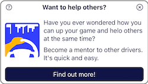
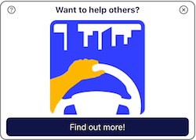
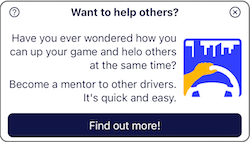

# Campaign Cards

Survey and Call-to-Action (CTA) Campaigns may have a campaign card associated to them.  This allows a "preview" display to be presented on the dashboard or a custom page in the app.

## Declaring a Campaign Card
```elixir

card = CampaignPreview.new()
```

## Set the content

|  |  |  |
|-- |-- |--
|Left Image + Description | Image Only (use left image w/o text) | Right Image + Description |


### Adding Left and Right images

```elixir

card = CampaignPreview.new()
|> CampaignPreview.with_left_image_url("#{@example_preview}/preview.png")

card = CampaignPreview.new()
|> CampaignPreview.with_right_image_url("#{@example_preview}/preview.png")
```

* Without a description, the left-hand image takes the entire campaign card view.

### Adding Text

```elixir

card = CampaignPreview.new()
|> CampaignPreview.with_left_image_url("#{@example_preview}/preview.png")
|> CampaignPreview.with_title("Want to help others?")
|> CampaignPreview.with_description([
  "Have you ever wondered how you can up your game and helo others at the same time?",
  "Become a mentor to other drivers.  It's quick and easy."
])
```

### Adding Actions

[Campaign Actions](../campaign_actions/README.md) define how a user may interact with the campaign card.


Add a Detail action to open the campaign in full screen view

```elixir
card
|> CampaignPreview.with_action(
  CampaignAction.new(:show_more, :detailt, "Learn More")
)
```

Add an accept action presented as a button button

```elixir
card
|> CampaignPreview.with_action(
  CampaignAction.new(:add_goals, :accept, "Let's Get Started")
)
```

Add a postpone (for 90 minutes) action as a link

```elixir
card
|> CampaignPreview.with_action(
  CampaignAction.new(:remind_later, :postpone, "Maybe Later")
  |> CampaignAction.with_postpone_minutes(90)
  |> CampaignAction.as_link()
)
```

Add a dismiss action presented as a toolbar icon button

```elixir
card
|> CampaignPreview.with_action(
  CampaignAction.new(:no_thanks, :dismiss, "X")
  |> CampaignAction.as_header_tool()
)
```

## Associate a Campaign Card to a CTA or Survey

* The category of the campaign determines where the preview will surface in the UI.  See [Dashboards and Custom Pages](../dashboard_and_custom_pages/README.md) for more info.


```elixir

card = CampaignPreview.new()

CallToAction.new(:example_cta)
|> Campaign.with_category(:to_dos)
|> Campaign.with_preview(card)
```