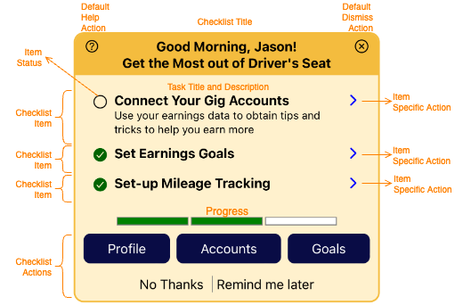

# Checklists

A checklist is a list of tasks/items with status information. Unlike surveys and CTAs, checklists appear as cards that are embedded within other application pages and do not have a full-screen view.



* [Declaring a Checklist](#declaring-a-checklist) - required
* [Set Category to Determine Placement](#set-the-category) - required
* [Adding a Title](#adding-a-title) - optional
* [Defining the Checklist Items](#adding-checklist-items) - required
* [Showing Progress Bar](#showing-progress-bar) - optional
* [Adding Checklist Level Actions](#add-checklist-actions) - optional

## Declaring a Checklist

```elixir
defmodule DriversSeatCoop.Marketing.Campaigns.Examples do

  alias DriversSeatCoop.Marketing.Campaign
  alias DriversSeatCoop.Marketing.CampaignAction
  alias DriversSeatCoop.Marketing.Checklist
  alias DriversSeatCoop.Marketing.ChecklistItem
  
  def checklist do
    Checklist.new(:example_checklist)
  end
end
```

## Set the Category

Categories determine how the checklist will be surfaced in the application.

```elixir
checklist
|> Campaign.with_category(:to_dos)
```

* the `:interrupt` category is not applicable for checklists.  Full-screen views of checklists are not supported.

## Adding a Title

Adding a static title

```elixir
checklist
|> Checklist.with_title("Getting the Most out of Driver's Seat")
```

Add a dynamic title by supplying a function that accepts a [CampaignState](../../../lib/dsc/marketing/campaign_state.ex) struct and returns a string or a list of strings.

```elixir
checklist
|> Checklist.with_title(fn %CampaignState{} = state ->
  [
    "Hello #{state.user.first_name}",
    "Here's your daily rundown"
  ]
end)
```

## Adding Checklist Items

Add checklist item(s) by supplying a function accepting a [CampaignState](../../../lib/dsc/marketing/campaign_state.ex) struct and returning one or many checklist items.  

* `%CampaignState{}` is helpful for determining the status of checklist items.
* `%CampaignState{}` can also be used to filter the items of the checklist.

```elixir
checklist
|> Checklist.with_item(fn %CampaignState{} = state ->
  #RETURN ONE OR MANY ITEMS HERE
end)
```

For each checklist item, 

* **Declare the item** - Required

  Each checklist item should have a unique identifier within the checklist.

  ```elixir
  checklist
  |> Checklist.with_item(fn %CampaignState{} = state ->
    
    ChecklistItem.new(:complete_profile)

  end)
  ```

* **Title and/or Description** - Required
  
  Set the title and/or descriptive text for the item

  ```elixir
  checklist
  |> Checklist.with_item(fn %CampaignState{} = state ->
    
    ChecklistItem.new(:complete_profile)
    |> ChecklistItem.with_title("Complete your profile")
    |> ChecklistItem.with_description("Tell us more about you so we can give you better tips and recommendations.")

  end)
  ```

* **Status** - Required
  
  Set the status of the item.  The status may be one of: `:none`, `:new`, `:not_started`, `:in_process`, `:requires_attention`, `:complete`.

  ```elixir
  checklist
  |> Checklist.with_item(fn %CampaignState{} = state ->
    
    ChecklistItem.new(:complete_profile)
    |> ChecklistItem.with_title("Complete your profile")
    |> ChecklistItem.with_description("Tell us more about you so we can give you better tips and recommendations.")
    |> ChecklistItem.with_status(:in_process)

  end)
  ```

* **Associate an Action** - Optional
  
  Optionally add an action.  Usually the action navigates the user to a place where they may view/address the checklist item.
  
  ```elixir
  checklist
  |> Checklist.with_item(fn %CampaignState{} = state ->
    
    ChecklistItem.new(:complete_profile)
    |> ChecklistItem.with_title("Complete your profile")
    |> ChecklistItem.with_description("Tell us more about you so we can give you better tips and recommendations.")
    |> ChecklistItem.with_status(:in_process)
    |> ChecklistItem.with_action(
      CampaignAction.new(:update_profile, :custom, "update profile")
      |> CampaignAction.with_url("profile")
    )

  end)
  ```

## Showing Progress Bar

Optionally show a progress bar at the bottom of the checklist.

```elixir
checklist
|> Checklist.show_progress()
```

## Add Checklist Actions

In addition to checklist items, the checklist itself can have actions.

Add a dismiss action presented as a Link

```elixir
checklist
|> Checklist.with_action(
  CampaignAction.new(:no_thanks, :dismiss, "No Thanks")
  |> CampaignAction.as_link()
)
```

Add a dismiss action presented as header tool close button.

```elixir
checklist
|> Checklist.with_action(
  CampaignAction.new(:no_thanks, :dismiss, "X")
  |> CampaignAction.as_header_tool()
)
```

Add a help action as a header tool help icon.

```elixir
checklist
|> Checklist.with_action(
  CampaignAction.new(:question, :help, "I have a question")
  |> CampaignAction.with_data(%{
    message_text: "[ Tell us how we can help you with this campaign ]"
  })
  |> CampaignAction.as_header_tool()
)
```

