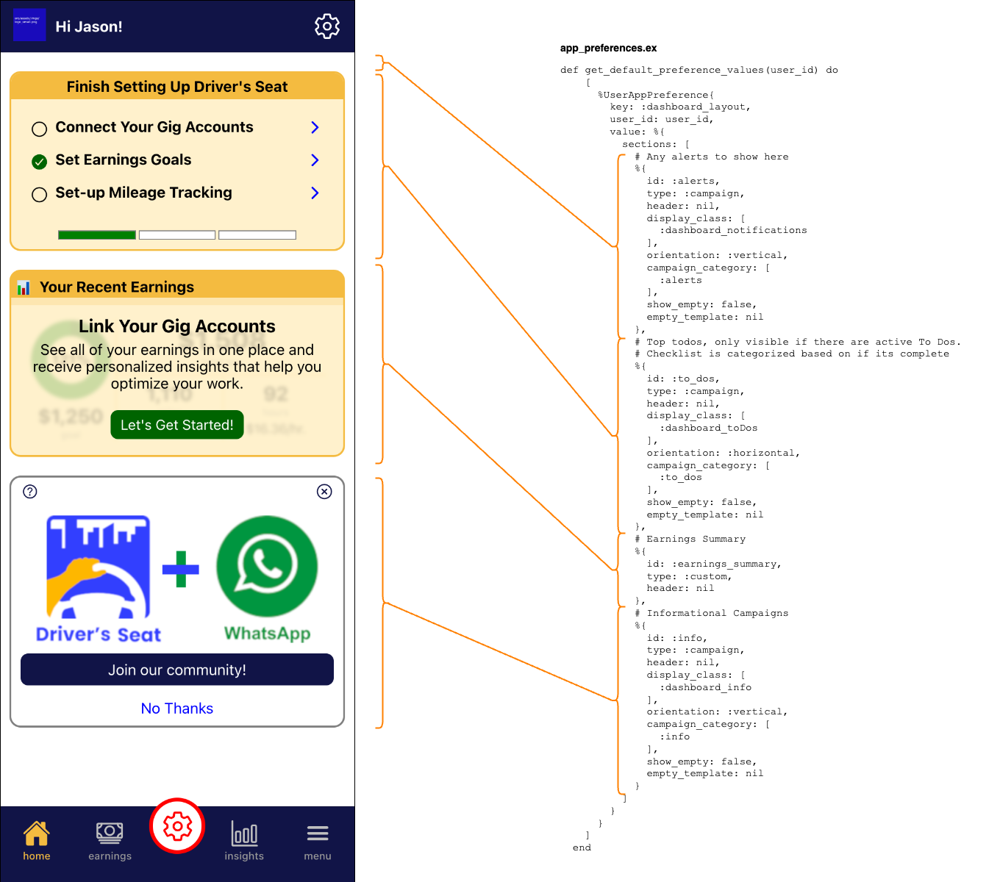
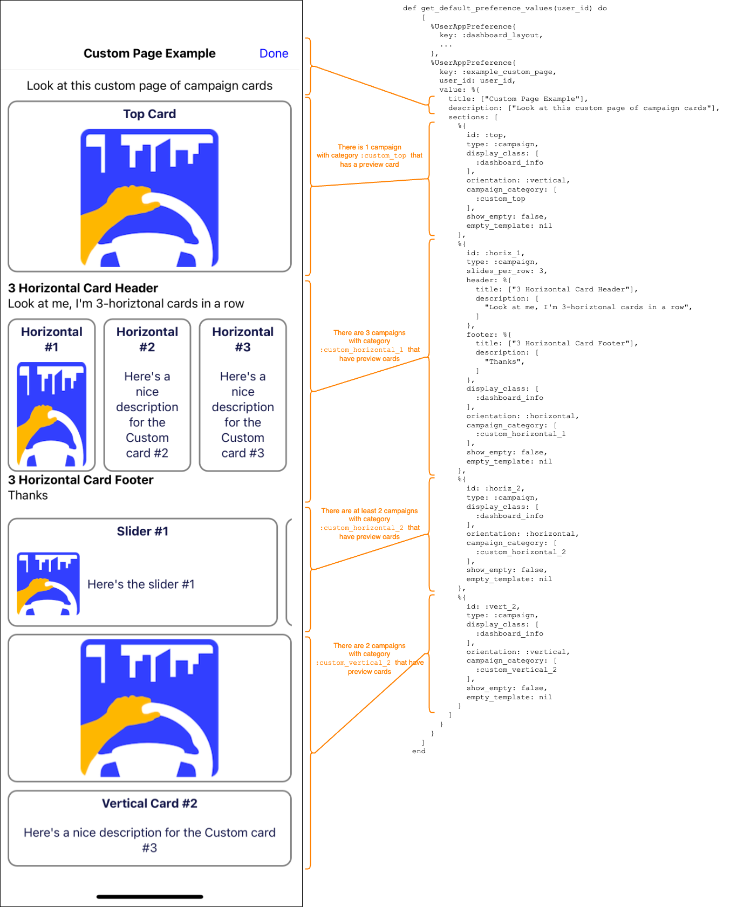

# Dashboard Layout and Custom Pages


## [App Preferences](../../../lib/dsc/app_preferences.ex)

A [preference](../../../lib/dsc/app_preferences/user_app_preference.ex) is a generic store (as JSON) for a specific configuration settings.  Values for each user are stored in table `user_app_preferences`

For example, each user's Community Insights settings are saved under preference code `average_hourly_pay_analytics`

```json
{
  "display_value": "avgHourlyPay", 
  "metro_area_id": 779, 
  "deduct_mileage": false, 
  "service_classes": ["delivery", "rideshare", "services"], 
  "highlight_work_schedule": true
}
```

Function `get_default_preference_values(user_id)` returns default values (if any) for preferences.

## Customizing the Dashboard

The dashboard/landing-page layout is managed by setting a default App Preference called `dashboard_layout`.  There is nothing in the mobile application to change the value of this preference.  Using a preference value allows changes to the dashboard layout without having to perform a mobile app release.

Here's a map of how the preference value maps to the display.



* Each section of the dashboard is based on one or many campaign categories
* a section has a horiztonal or vertical layout


```elixir
  %UserAppPreference{
    key: :dashboard_layout,
    user_id: user_id,
    value: %{
      sections: [
        # Any alerts to show here
        %{
          id: :alerts,
          type: :campaign,                # This section is for a campaign card set (for future use)
          header: nil,                    
          display_class: [
            :dashboard_notifications      # CSS class to apply to the campaign cards
          ],
          orientation: :vertical,         # Horizontal = swiper
          campaign_category: [
            :alerts                       # The category/categories for the campain to show in this section
          ],
          show_empty: false,
          empty_template: nil             # Text to display when there are no campaigns in the ctegories above
        }, ...
      ]
    }
  }
```


## Custom Pages

The same mechanism used to customize the dashboard can be used to create custom page in the mobile app.



A user can be navigated to the custom page via a [Campaign Action](../campaign_actions/README.md)

```elixir
CallToAction.new(:community)
|> Campaign.with_category(:info)                                            # appears on dashboard/landing page
|> Campaign.with_preview(
  CampaignPreview.new()
  |> CampaignPreview.with_left_image_url("#{@example_preview}/preview.png")
  |> CampaignPreview.with_title("Explore your community")
  |> CampaignPreview.with_action([
    CampaignAction.new(:join, :custom, "Learn more")
    |> CampaignAction.with_url("/marketing/custom/example_custom_page"),    # Navigate to custom page
    CampaignAction.new(:dismiss, :dismiss, "X")
    |> CampaignAction.as_header_tool()
  ])
)
```