# Surveys

Surveys are campaigns that present and collect information from users.  They are divided into multiple pages (called sections).

|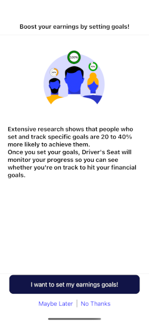 | 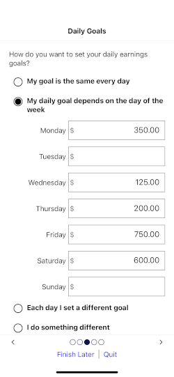  | 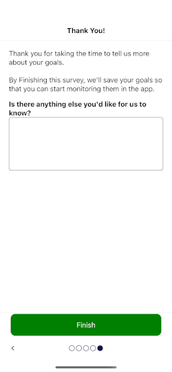  |
|--                         |--                           |--                           |

* [Declaring the Survey](#declaring-a-survey) - required
* Adding [Content Sections](#adding-a-content-section) or [Form Sections](#adding-a-form-section) - required
* [Showing/Hiding Pagination Controls](#page-markers-and-navigation-arrows)
* [Adding Section Actions](#section-actions)
* [Campaign State for Surveys](#campaign-state-for-survey-data)

## Declaring a Survey

Declare the Survey

```elixir
defmodule DriversSeatCoop.Marketing.Campaigns.Examples do

  alias DriversSeatCoop.Marketing.Survey
  alias DriversSeatCoop.Marketing.SurveyItem
  alias DriversSeatCoop.Marketing.SurveySection
  
  @example_survey :example_survey

  def survey do
    Survey.new(@example_survey)
  end
end
```

## Adding a Content Section

A content section presents external content for the page.  It is very similiar to [creating a Call To Action](../call_to_action/README.md#identifying-the-content-required) except that it represents a single/section of the survey.

```elixir
defmodule DriversSeatCoop.Marketing.Campaigns.Examples do

  alias DriversSeatCoop.Marketing.Survey
  alias DriversSeatCoop.Marketing.SurveyItem
  alias DriversSeatCoop.Marketing.SurveySection
  
  @example_survey :example_survey

  def survey do
    Survey.new(@example_survey)
    |> Survey.with_section(
      SurveySection.new(:welcome)
      |> SurveySection.with_content_url("#{@example_survey}/index.html")
    )
  end
end
```

* [Externally Hosted Content](../call_to_action/README.md#externally-hosted-content)
* [Self Hosted Content](../call_to_action/README.md#self-hosted-content)
* [YouTube Video Content](../call_to_action/README.md#youtube-video-content)

## Adding a Form Section

Form sections usually collect information from the user.  Form sections are composed of items.

### Adding Items to a Form Section

Items can be added individually, as a list, or dynamically based on a function that accepts a [CampaignState](../../../lib/dsc/marketing/campaign_state.ex) struct and returns a list of items.

```elixir
Survey.new(@example_survey)
|> Survey.with_section(
  SurveySection.new(:welcome)
  |> SurveySection.with_item( ... )
  |> SurveySection.with_item([ ... ] )
  |> SurveySection.with_item(fn %CampaignState{} = state -> ... end)
)
```

#### Informational

Add descriptive information to the user using an informational item.

| 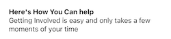              | 
|--                                                   |

```elixir
SurveySection.with_item(
  SurveyItem.info()
  |> SurveyItem.with_title("Here's How You Can help")
  |> SurveyItem.with_description("Getting Involved is easy and only takes a few moments of your time")
)
```

#### Images

Display an image to the user.

|             | 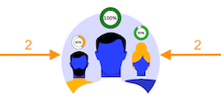      |
|--                                                   |--                                                           |

```elixir
section
|> SurveySection.with_item([
  SurveyItem.content("#{@example_survey}/welcome.png"),   #self hosted
])

section
|> SurveySection.with_item(
  SurveyItem.content("#{@example_survey}/welcome.png")
  |> SurveyItem.with_indent(2)        # Idents the image on both the left and right (approx 40px)
  |> SurveyItem.with_indent_left(2)   # Idents the image on left only (approx 80px)
  |> SurveyItem.with_indent_right(2)  # Idents the image on right only (approx 80px)
)
```

* Find more information about [Self Hosted Content](../call_to_action/README.md#self-hosted-content).
* By default, the iamge will be sized to 100% width. Optionally use `with_indent` to make it smaller.

#### Text Boxes

Collect text information from the user.  They can be either single-line or multi-line.

| 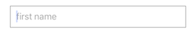  | 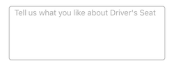    |
|--                                                   |--                                                   |

```elixir
#single line text
section
|> SurveySection.with_item(
  SurveyItem.text(:first_name, :short_text)
  |> SurveyItem.with_hind("first name")
)

#multi-line text
section
|> SurveySection.with_item(
  SurveyItem.text(:first_name, :long_text)
  |> SurveyItem.with_hint("Tell us what you like about Driver's Seat")
)
```

#### Radio Buttons

Present a set of mutually exclusive choices as radio buttons.  Items with the same field_id (:hours_per_week in this example) are mutually exclusive.

| 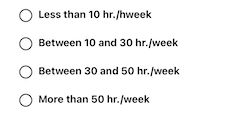            |
|--                                                   |

```elixir
section
|> SurveySection.with_item([
  SurveyItem.radio_button(:hours_per_week, :lt_10)
  |> SurveyItem.with_title("Less than 10 hr./hweek"),
  SurveyItem.radio_button(:hours_per_week, :btwn_10_30)
  |> SurveyItem.with_title("Between 10 and 30 hr./week"),
  SurveyItem.radio_button(:hours_per_week, :btwn_30_50)
  |> SurveyItem.with_title("Between 30 and 50 hr./week"),
  SurveyItem.radio_button(:hours_per_week, :gt_50)
  |> SurveyItem.with_title("More than 50 hr./week")
])
```

#### Checkboxes

Checkboxes can be used to present a single option or multiple options.

| 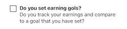    | 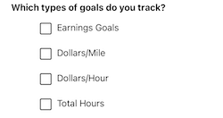   |
|--                                                               |--                                                               |

```elixir
# single option
section
|> SurveySection.with_item(
  SurveyItem.checkbox(:sets_goals, :yes)      # If a value is not supplied, it defaults to TRUE
    |> SurveyItem.with_title("Do you set earning gols?")
    |> SurveyItem.with_description("Do you track your earnings and compare to a goal that you have set?")
)

# multiple options
section
|> SurveySection.with_item([
  SurveyItem.info()
  |> SurveyItem.with_title("Which types of goals do you track?"),
  SurveyItem.checkbox(:goal_types, :earnings)
  |> SurveyItem.with_description("Earnings Goals")
  |> SurveyItem.with_indent_left(1),
  SurveyItem.checkbox(:goal_types, :earning_per_mile)
  |> SurveyItem.with_description("Dollars/Mile")
  |> SurveyItem.with_indent_left(1),
  SurveyItem.checkbox(:goal_types, :dollars_per_hour)
  |> SurveyItem.with_description("Dollars/Hour")
  |> SurveyItem.with_indent_left(1),
  SurveyItem.checkbox(:goal_types, :total_hours)
  |> SurveyItem.with_description("Total Hours")
  |> SurveyItem.with_indent_left(1)
])
```

#### Numeric and Currency Values

Collect a numeric value

| 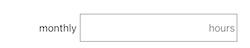  | 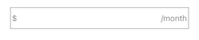  |
|--                                             |--                                               |

```elixir
# Numeric Value
section
|> SurveySection.with_item(
  SurveyItem.numeric(:hours_per_month)
  |> SurveyItem.with_scale(0)                 # optional: whole number
  |> SurveyItem.with_label("monthly")         # optional
  |> SurveyItem.with_uom_right("hours")       # optional
)

# Currency Value
section
|> SurveySection.with_item(
  SurveyItem.currency(:monthly_goal)
  |> Surveyitem.with_scale(0)                 # optional: whole dollar
  |> SurveyItem.with_uom_right("/month")      # optional
)
```

#### Date Values

| 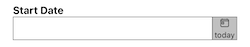        |
|--                                             |


```elixir
section
|> SurveySection.with_item(
  SurveyItem.date(:started_gig_work)
  |> SurveyItem.with_title("Start Date")
)
```

#### Segmented Buttons

| 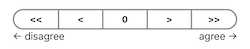  |
|--                                                     |

```elixir
section
|> SurveySection.with_item(
  SurveyItem.options(:rating)
  |> SurveyItem.with_option(:strong_disagree, "<<")
  |> SurveyItem.with_option(:disagree, "<")
  |> SurveyItem.with_option(:neutral, "0")
  |> SurveyItem.with_option(:agree, ">")
  |> SurveyItem.with_option(:strong_agree, ">>")
  |> SurveyItem.with_uom_left("← disagree")
  |> SurveyItem.with_uom_right("agree →")
)
```

#### Inline Actions

It may be helpful to present a [Campaign Action](../campaign_actions/README.md) in-line with other survey items.

| 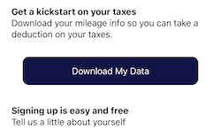   |
|--                                            |

```elixir
section
|> SurveySection.with_item([
  SurveyItem.info()
  |> SurveyItem.with_title("Get a kickstart on your taxes")
  |> SurveyItem.with_description("Download your mileage info so you can take a deduction on your taxes."),
  SurveyItem.spacer(),

  # This is the inline action
  SurveyItem.action(
    CampaignAction.new(:download_data, :custom, "Download My Data")
  ),

  SurveyItem.spacer(),
  SurveyItem.info()
  |> SurveyItem.with_title("Signing up is easy and free")
  |> SurveyItem.with_description("Tell us a little about yourself"),
  SurveyItem.spacer(),
  SurveyItem.text(:fname)
  |> SurveyItem.with_hint("first name")
])
```

#### Vertical Space

Add vertical space between survey items

| 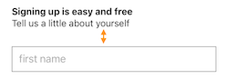   |
|--                                            |

```elixir
section
|> SurveySection.with_item([
  SurveyItem.info()
  |> SurveyItem.with_title("Signing up is easy and free")
  |> SurveyItem.with_description("Tell us a little about yourself"),
  SurveyItem.spacer(),
  SurveyItem.text(:fname)
  |> SurveyItem.with_hint("first name")
])
```

### Item Dependencies

Control the visibility of an items based on the value of other items.

| 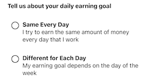  | 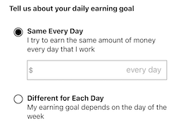   | 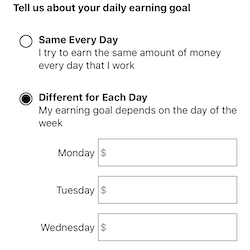 |
|---                                |---                                    |---                        |

```elixir
section
|> SurveySection.with_item([
  SurveyItem.info()
  |> SurveyItem.with_title("Tell us about your daily earning goal"),
  SurveyItem.spacer(),

  # Option #1
  SurveyItem.radio_button(:daily_goal_type, :same_every_day)
  |> SurveyItem.with_title("Same Every Day")
  |> SurveyItem.with_description("I try to earn the same amount of money every day that I work"),
  
  # Items that depend on Option #1
  SurveyItem.currency(:daily_goal_all)
  |> SurveyItem.with_indent_left(1)
  |> SurveyItem.with_hint("every day")
  |> SurveyItem.depends_on_value(:daily_goal_type, :same_every_day),
  SurveyItem.spacer(),


  # Option #2
  SurveyItem.radio_button(:daily_goal_type, :different_each_day)
  |> SurveyItem.with_title("Different for Each Day")
  |> SurveyItem.with_description("My earning goal depends on the day of the week"),

  # Items that depend on Option #2
  SurveyItem.currency(:daily_goal_mon)
  |> SurveyItem.with_indent_left(1)
  |> SurveyItem.with_label("Monday")
  |> SurveyItem.depends_on_value(:daily_goal_type, :different_each_day),
  SurveyItem.currency(:daily_goal_tue)
  |> SurveyItem.with_indent_left(1)
  |> SurveyItem.with_label("Tuesday")
  |> SurveyItem.depends_on_value(:daily_goal_type, :different_each_day),
  SurveyItem.currency(:daily_goal_wed)
  |> SurveyItem.with_indent_left(1)
  |> SurveyItem.with_label("Wednesday")
  |> SurveyItem.depends_on_value(:daily_goal_type, :different_each_day),
])
```

* If an item is no longer visible because of a dependency, its value is not validated and it is not saved.
* The dependancy can be based on an item in a different section.

### Data Validations

Enforce data quality standards on values prior to submitting a section.

#### Required and Numeric Range Validations

| 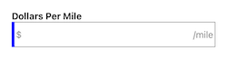 | 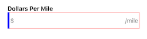 |
|---                                  |---                                    |

```elixir
section
# The currency item
|> SurveySection.with_item(
  SurveyItem.currency(:dollars_per_mile)
  |> SurveyItem.with_title("Dollars Per Mile")
  |> SurveyItem.with_uom_right("/mile")
)
# Validate that it is required and > $0.00 and < $100.00>
|> SurveySection.validate_required(:dollars_per_mile)
|> SurveySection.validate_min_value(:dollars_per_mile, 0.01)
|> SurveySection.validate_max_value(:dollars_per_mile, 100.01)

```

#### Selection is required

| 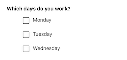 | 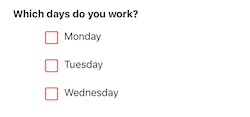 |
|---                                  |---                                    |

```elixir
section
# The checkboxes
|> SurveySection.with_item([
  SurveyItem.info()
  |> SurveyItem.with_title("Which days do you work?"),
  SurveyItem.checkbox(:work_days, :monday)
  |> SurveyItem.with_description("Monday")
  |> SurveyItem.with_indent_left(1),
  SurveyItem.checkbox(:work_days, :tuesday)
  |> SurveyItem.with_description("Tuesday")
  |> SurveyItem.with_indent_left(1),
  SurveyItem.checkbox(:work_days, :wednesday)
  |> SurveyItem.with_description("Wednesday")
  |> SurveyItem.with_indent_left(1)
])
# The validation
|> SurveySection.validate_required(:work_days)

```

## Page Markers and Navigation Arrows

By default, a survey section shows navigation buttons and page markers.  These can both be removed.
| 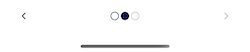
|-- |

```elixir
section
|> SurveySection.hide_page_navigation()
|> SurveySection.hide_page_markers()
```

## Section Actions

[Campaign Actions](../campaign_actions/README.md) define how a user may interact with the survey.  They are defined on each section.

Add an accept action presented as a button button

```elixir
section
|> SurveySection.with_action(
  CampaignAction.new(:add_goals, :accept, "Let's Get Started")
)
```

Add a postpone (for 90 minutes) action as a link

```elixir
section
|> SurveySection.with_action(
  CampaignAction.new(:remind_later, :postpone, "Maybe Later")
  |> CampaignAction.with_postpone_minutes(90)
  |> CampaignAction.as_link()
)
```

Add a dismiss action presented as a Link

```elixir
section
|> SurveySection.with_action(
  CampaignAction.new(:no_thanks, :dismiss, "No Thanks")
  |> CampaignAction.as_link()
)
```

Add a dismiss action presented as header tool close button.

```elixir
section
|> SurveySection.with_action(
  CampaignAction.new(:no_thanks, :dismiss, "X")
  |> CampaignAction.as_header_tool()
)
```

Add a help action as a link

```elixir
section
|> SurveySection.with_action(
  CampaignAction.new(:question, :help, "I have a question")
  |> CampaignAction.with_data(%{
    message_text: "[ Tell us how we can help you with this campaign ]"
  })
  |> CampaignAction.as_link()
)
```

Add a help action as a header tool help icon.

```elixir
section
|> SurveySection.with_action(
  CampaignAction.new(:question, :help, "I have a question")
  |> CampaignAction.with_data(%{
    message_text: "[ Tell us how we can help you with this campaign ]"
  })
  |> CampaignAction.as_header_tool()
)
```

Often, the first page of a survey is an introduction.  Instead of page navigation markers, a `:next` action can be presented as a button.

```elixir
section
|> SurveySection.with_action([
  CampaignAction.new(:start, :next, "Let's get started!"),
])
```


### Adding actions conditionally

Add an action conditionally to a Survey Section by supplying a function that, given `%CampaignState{}` evaluates to TRUE or FALSE

This example only allows the user to pospone a campaign once.  If the user has NOT previously dismissed the campaign, add the postpone action.

```elixir
section
|> SurveySection.with_conditional_action(
  # function returning t/f
  fn %CampaignState{} = state ->
    is_nil(state.participant.postponed_until)
  end,
  # action or actions if true
  CampaignAction.new(:remind_later, :postpone, "Maybe Later")
  |> CampaignAction.with_postpone_minutes(90)
  |> CampaignAction.as_link()
)
```

### Adding actions dynamically

Add actions dynamically to a Survey Section by supplying a function that, given `%CampaignState{}` returns a list of `%CampaignAction{}`.

This example only allows the go to blog action (as button) if the user's account is at least 5 days old.

```elixir
section
|> SurveySection.with_action(fn %CampaignState{} = state ->
  account_age_seconds = NaiveDateTime.diff(NaiveDateTime.utc_now(), state.user.inserted_at)

  if account_age_seconds >= 432_000 do
    CampaignAction.new(:blog, :custom, [
      "Get the lastest Driver News",
      "Check out the Driver's Seat Blog"
    ])
    |> CampaignAction.with_url("https://blog.driversseat.co")
  else
    []
  end
end)
```
